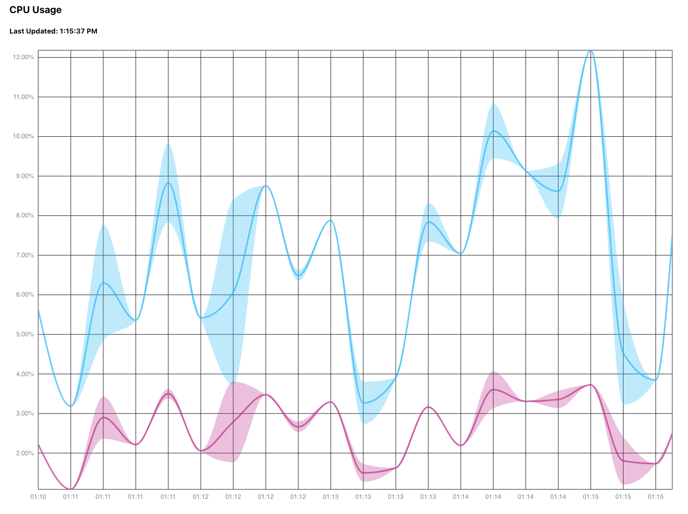

# Giraffe Playground

This playground contains examples of the React-based [Giraffe](https://github.com/influxdata/giraffe) virtualization library created by [InfluxData](https://www.influxdata.com/).

Giraffe examples included thus far:
- Band plot

## What's inside:

**Client:**

React app created with [create-react-app](https://github.com/facebook/create-react-app) that uses Giraffe to render plots. See the `client` directory.

**Server**

ExpressJS server that uses both the [InfluxDB API](https://docs.influxdata.com/influxdb/v2.0/reference/api/) and the [influxdb-client-js](https://github.com/influxdata/influxdb-client-js) library to query data from an InfluxDB instance. See `server` directory.

## How to:

**Start server**

1. Navigate to `server` directory in terminal
1. Export your environment variables

```sh
export INFLUX_URL=http://localhost:9999
export INFLUX_TOKEN=foo
export ORG_ID=1234
export BUCKET_NAME=my-bucket
```
1. `npm install`
1. `npm run server`
1. Server starts at `localhost:3001`

**Start UI**

1. Navigate to `client` directory in second terminal
1. `npm install`
1. `npm start`
1. Navigate to `localhost:3000`

# Examples

## Band Plot - CPU Usage

To show off the Band plot, we'll be plotting our CPU usage! 

To see what the band chart can do, check out the Giraffe [storybook](https://influxdata.github.io/giraffe/?path=/story/band-chart--static-csv) and here is the storybook's [source](https://github.com/influxdata/giraffe/blob/master/stories/src/band.stories.tsx).

**Setting up InfluxDB**

Ok first things first, create a bucket in your InfluxDB cloud instance! Then click "Add Data" followed by "Configure a Telegraf Agent". Select "System" and note the provided token and telegraf command. Go ahead and exectue those in a terminal.

Next, create an all access token for your InfluxDB by going to "Data" and clicking the "Tokens" tab. Generate an "All Access Token". We'll use this for our app. 

**Setting up this app**

Ok now, in a new terminal, export all the variables such as `INFLUX_URL` (which is the route to your InfluxDB instance), `INFLUX_TOKEN` (which is the all access token we just created), `ORG_ID` (which can be found by clicking your avatar in InfluxDB and selecting "About"), and finally, `BUCKET_NAME`. That's basically it! Now start the server in this terminal using the instructions above.

Finally, start the UI in a 3rd terminal and navigate to `localhost:3000`. You should see the following:



# Credits

This project was inspired by @hoorayimhelping's [giraffeboi](https://github.com/hoorayimhelping/giraffeboi).